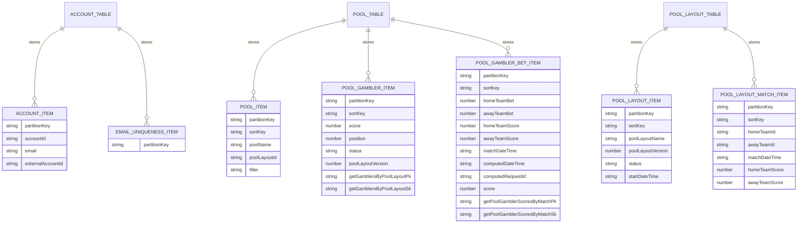

# Tyche

## What is Tyche?

Tyche is a mobile app for playing **"polla"** (Colombia) / **"quiniela"** (Spain) — a prediction pool game where:

- A group of people joins a pool
- Each participant (gambler) predicts the results of a set of matches (typically football/soccer)
- Points are awarded based on prediction accuracy (exact score, correct winner, etc.)
- The person with the most points wins

## Tech Stack

- **Backend:** F# on AWS Lambda, DynamoDB (single-table design per bounded context), SQS FIFO
- **Mobile:** iOS (Swift), Android (Kotlin)
- **Hosting:** Firebase Hosting (privacy policy page)

## DynamoDB Model

The persistence layer uses **three DynamoDB tables**, one per bounded context:
`Account`, `Pool`, `PoolLayout`. Each table follows the **single-table design** pattern internally — multiple entity types share the same `pk`/`sk` keys, distinguished by prefixed key values (e.g. `POOL#<ulid>`, `GAMBLER#<ulid>`, `MATCH#<ulid>`). Tables are split by domain (not collapsed into one) so each bounded context owns its schema, lambdas, and DynamoDB Streams independently.

Schema definitions live in `*Table.fs` files (e.g. `Felipearpa.Tyche.Pool/src/Infrastructure/PoolTable.fs`) and key strings are built via `KeyPrefix.build` from `Felipearpa.Data.DynamoDb`.

### Entity / Key Map

The diagram shows `partitionKey`/`sortKey` for readability — the real DynamoDB column names are `pk` and `sk`.



### Key Patterns by Entity

| Entity | Table | `pk` | `sk` |
|---|---|---|---|
| Account | `Account` | `ACCOUNT#<accountId>` | — |
| Email lock | `Account` | `EMAIL#<email>` | — |
| Pool root | `Pool` | `POOL#<poolId>` | `POOL#<poolId>` |
| Pool gambler / score | `Pool` | `POOL#<poolId>` | `GAMBLER#<gamblerId>` |
| Pool gambler bet | `Pool` | `GAMBLER#<gamblerId>#POOL#<poolId>` | `MATCH#<matchId>` |
| Pool layout root | `PoolLayout` | `POOLLAYOUT#<layoutId>` | `POOLLAYOUT#<layoutId>` |
| Pool layout match | `PoolLayout` | `POOLLAYOUT#<layoutId>` | `MATCH#<matchId>` |

### Real Item Examples

`Account` table — account record + email uniqueness lock:

```
{ "pk": "ACCOUNT#01KQBTS379WKPAQFJEM2HAA0J6", "accountId": "01KQBTS3…", "email": "user@example.com", "externalAccountId": "<firebase-uid>" }
{ "pk": "EMAIL#user@example.com" }
```

`Pool` table — three entity shapes coexist:

```
# Pool root
{ "pk": "POOL#01KQ7PXAR21QBJBEEQ7EFRNQGE", "sk": "POOL#01KQ7PXAR21QBJBEEQ7EFRNQGE", "poolName": "...", "poolLayoutId": "..." }

# Pool membership / score row
{ "pk": "POOL#01KQ7PXAR21QBJBEEQ7EFRNQGE", "sk": "GAMBLER#01KQ7PWR1HGFE4TXT5MPSZW595", "score": 12, "position": 3, "status": "OPENED" }

# Bet on a match
{ "pk": "GAMBLER#01KQFJP456DCP6F1S83H44W08A#POOL#01KQ7RB178WS8FEZX3ZXWT5TR0",
  "sk": "MATCH#01KQ7QY1PWNYGFFD5VSWAR8H9V",
  "homeTeamBet": 2, "awayTeamBet": 1, "matchDateTime": "2026-06-12T17:00:00Z" }
```

`PoolLayout` table — layout root + its matches:

```
{ "pk": "POOLLAYOUT#01KQ3GSQ96C6BMKF1FGXP2767H", "sk": "POOLLAYOUT#01KQ3GSQ96C6BMKF1FGXP2767H", "poolLayoutName": "World Cup 2026", "status": "OPENED" }
{ "pk": "POOLLAYOUT#01KQ3GSQ96C6BMKF1FGXP2767H", "sk": "MATCH#01KQ3HPW41N7XVP1B1QACTGRHG", "homeTeamName": "...", "matchDateTime": "..." }
```

### Global Secondary Indexes

| Table | Index | Hash | Range | Purpose |
|---|---|---|---|---|
| Account | `GetByEmail-index` | `email` | — | Look up account by email at sign-in |
| Pool | `GetPendingPoolGamblerBets-index` | `pk` (`GAMBLER#…#POOL#…`) | `matchDateTime` | Bets a gambler still has to make, oldest match first |
| Pool | `GetFinishedPoolGamblerBets-index` | `pk` (`GAMBLER#…#POOL#…`) | `computedDateTime` | Bets already scored, newest first (timeline) |
| Pool | `GetPoolGamblerScoresByGambler-index` | `sk` (`GAMBLER#…`) | `score` | All pools a gambler is in, ranked |
| Pool | `GetPoolGamblerScoresByPool-index` | `pk` (`POOL#…`) | `score` | Leaderboard within a pool |
| Pool | `GetPoolGamblerScoresByMatch-index` | `getPoolGamblerScoresByMatchPk` (`MATCH#…`) | `getPoolGamblerScoresByMatchSk` (`POOL#…#GAMBLER#…`) | Fan-out: every bet on a match across all pools when score is published |
| Pool | `GetGamblersByPoolLayout-index` | `getGamblersByPoolLayoutPk` (`POOLLAYOUT#…`) | `getGamblersByPoolLayoutSk` | Backfill new matches into every gambler's bet sheet when a layout adds matches |
| PoolLayout | `GetOpenedPoolLayout-index` | `status` | `startDateTime` | List currently open layouts users can join |

### How the Model Is Built

- **Composite keys encode the access pattern.** `POOL#…` + `GAMBLER#…` lets one query return a pool and all its members; `GAMBLER#…#POOL#…` + `MATCH#…` localizes a gambler's bets to one partition for fast list queries.
- **Denormalized GSI keys.** `getPoolGamblerScoresByMatchPk/Sk` and `getGamblersByPoolLayoutPk/Sk` are extra attributes written alongside the item so a single record can be queried from multiple angles without scans. They are written by `*RequestBuilder.fs` / `*Transformer.fs` modules.
- **Sentinel attributes act as filters.** Whether a bet is *pending* vs *finished* is decided by whether `computedRequestId` exists — pending queries use `attribute_not_exists(computedRequestId)`, finished queries hit a GSI keyed on `computedDateTime`.
- **Uniqueness via lock items.** A second `EMAIL#…` row in `Account` enforces email uniqueness through a conditional `Put` (`attribute_not_exists(pk)`), since DynamoDB has no unique-secondary-index concept.
- **Score writes use `TransactWriteItems`**, then SQS FIFO publishes a position-update message keyed by pool so leaderboard recompute is serialized per pool (see [Score Computation Architecture](/Users/felipe/.claude/projects/-Users-felipe-Documents-Codes-tyche/memory/project_score_computation.md)).

## Code Preferences

- Idiomatic F#: no mutable collections, prefer functional approaches
- No NoOp/stub implementations for DI — it's a code smell
- Repositories = data access only, no messaging or orchestration
- Callbacks should be async when involving I/O
- Naming: verb-first for callbacks (e.g., `onComputePool`), avoid past tense
- Always question if the approach is the most optimal and cleanest before implementing
- Discuss tradeoffs before implementing architectural decisions
