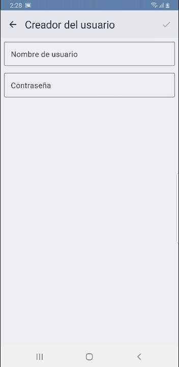
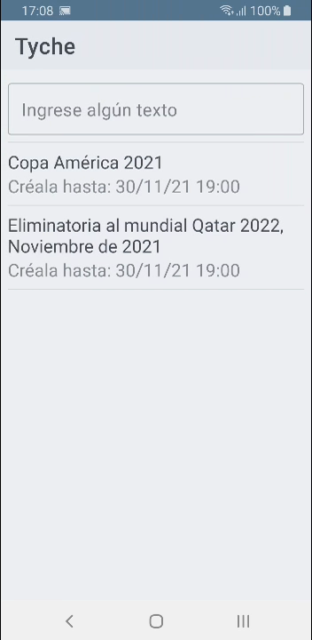
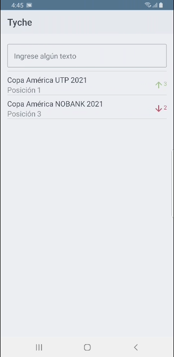
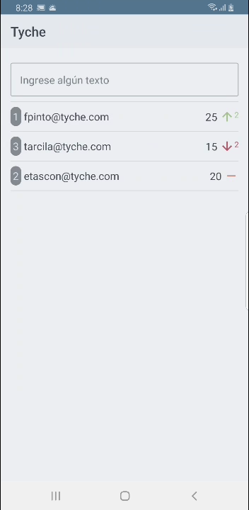
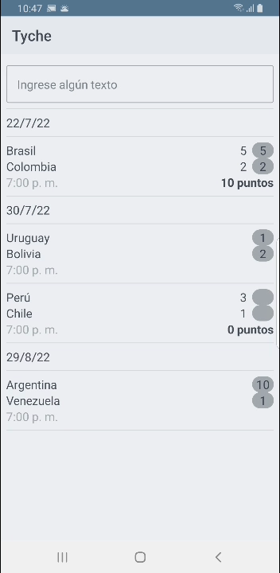

# Tyche for Android

Tyche is an App for playing soccer pools. The preferred language of App is Spanish. It has the next views:

## User creator

This view permits create a new user.

## PoolLayout

This view shows a list of opened PoolLayout which they are available to create and play.

## Pool

This view shows a list of Pool associated to a PoolLayout.

## PoolGambler

This view shows a list of PoolGambler associated to a Pool.

## PoolGame

This view shows a list of PoolGame associated to a Pool.

